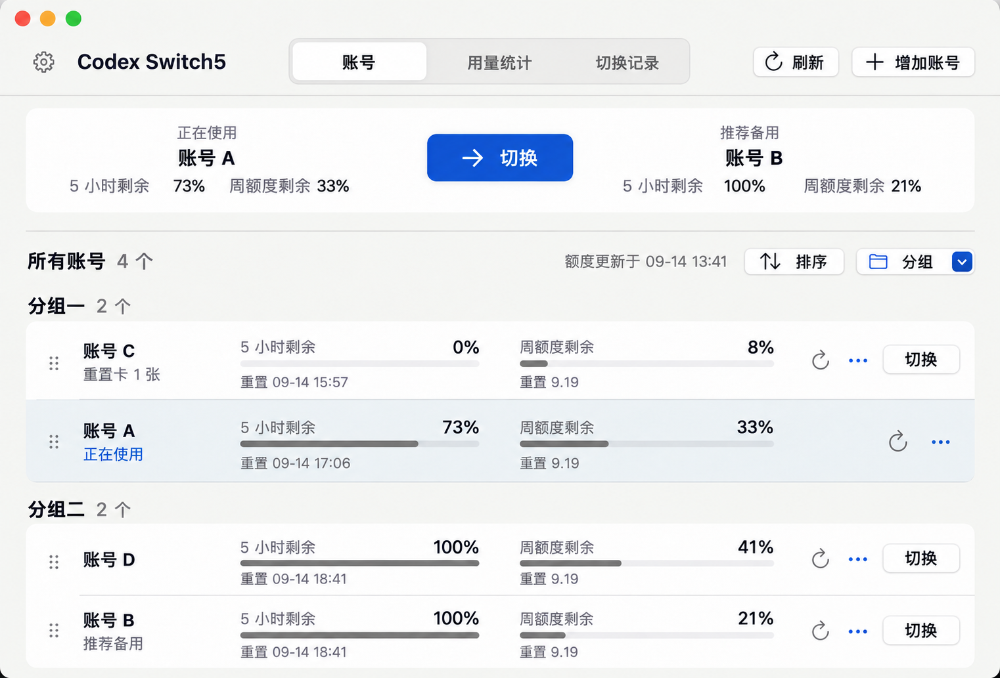
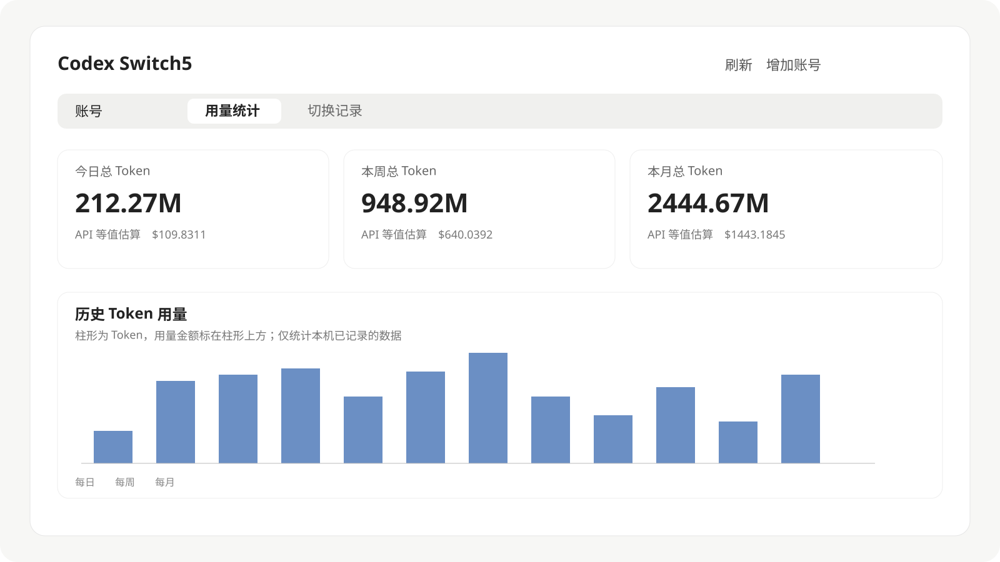

<h1 align="center">
   Codex Switch5
</h1>

<strong>在 Mac 上管理多个 Codex 账号，查看剩余额度，快速切换。</strong>

5 小时与周额度一目了然，也能查看各账号的 Token 用量。

  <a href="https://github.com/justamanm/codex-switcher/releases/tag/latest"><strong>下载 macOS 版</strong></a> ·
  <a href="docs/使用说明_zh.md">使用说明</a> ·
  <a href="README_en.md">English</a> 
  macOS 14+

界面示意 · 演示账号与数据 · 支持中文和英文

用量统计页界面示意 · 今日、本周、本月 Token 与历史趋势

## 功能介绍

### 账号管理与切换

- **自动识别**：启动后自动读取本地已登录账号和可识别的账号存档，无需逐个导入。
- **快速切换**：并排查看当前账号与推荐备用账号，也可以从列表中自行选择。
- **整理账号**：设置别名、分组，拖动调整顺序，或按额度排序；登录失效时可重新登录。

### 额度一目了然

- 同时显示每个账号的 **5 小时额度、周额度与重置时间**。
- 支持刷新全部账号、单独刷新，以及按设置的间隔自动刷新。
- 区分当前账号、推荐账号与需要重新登录的账号，减少逐个检查。

### 用量统计与记录

- **统计信息**：汇总今日、本周、本月的 Token，用输入、输出为主的明细查看用量构成。
- **账号明细**：对比各账号的 5 小时周期、周额度周期及日、周、月用量。
- **历史与习惯**：按日、周、月浏览历史趋势，查看本周、本月或最近 30 天的时段分布。
- **切换记录**：回看账号切换与登录操作的结果。

缓存、推理与自动审查用量单独标注；自动审查不计入 Token 总数。金额与周额度预测按 API 等值价格估算，不代表订阅账单。

## 开始使用

1. **安装**：下载 DMG，将 Codex Switch5 拖入“应用程序”。
2. **添加账号**：打开后自动识别本地已登录账号；需要更多账号时，点击“增加账号”并按提示登录。
3. **查看与切换**：查看剩余额度，选择推荐账号或列表中的其他账号。使用 Codex CLI 时，先退出会话，切换后重新打开。

增加账号需要已安装 ChatGPT 或 Codex CLI。已有账号的切换不要求安装 ChatGPT。

macOS 提示无法打开？

当前构建采用临时签名。确认下载来自本项目后，可到“系统设置 → 隐私与安全性”查看是否提供“仍要打开”，并按系统提示操作。

## 数据与说明

登录凭据与统计记录保存在本机；查询额度时会连接 OpenAI 服务。Token 统计来自本机 Codex 会话记录。

仅删除 Codex Switch5 应用，会保留原有的本地账号凭据，不会因此影响 ChatGPT／Codex 的登录和使用。本应用的设置与统计记录也会保留；卸载不会自动恢复到切换前的账号。文件位置、登录流程及统计口径见[使用说明](docs/使用说明_zh.md)。

[反馈问题](https://github.com/justamanm/codex-switcher/issues) · [查看其他版本](https://github.com/justamanm/codex-switcher/releases)
