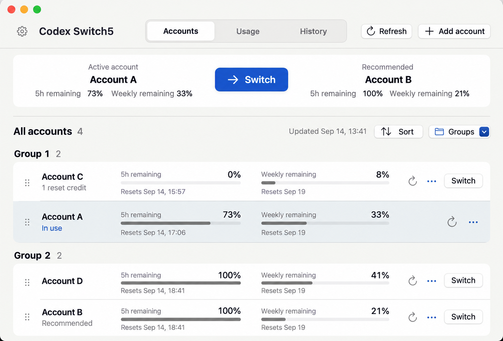

<h1 align="center">
   Codex Switch5
</h1>

<strong>Manage Codex accounts on your Mac. Check remaining quota. Switch quickly.</strong>

See 5-hour and weekly quota at a glance, with Token usage for each account.

  <a href="https://github.com/justamanm/codex-switcher/releases/tag/latest"><strong>Download for macOS</strong></a> ·
  <a href="docs/使用说明.md">User guide</a> ·
  <a href="README_zh.md">中文</a> 
  macOS 14+

Interface illustration · Demo accounts and data · Chinese and English supported

## Features

### Manage and switch accounts

- **Automatic discovery**: Find locally signed-in accounts and supported credential archives at startup, without importing each one manually.
- **Quick switching**: Compare the active and recommended accounts side by side, or choose another account from the list.
- **Account organization**: Use aliases and groups, drag to reorder, sort by quota, and sign in again when credentials expire.

### See remaining quota

- View each account’s **5-hour quota, weekly quota, and reset times** together.
- Refresh all accounts, refresh one account, or enable automatic refresh at a chosen interval.
- Identify the active account, recommended account, and accounts requiring sign-in at a glance.

### Usage and history

- **Overview**: See today’s, this week’s, and this month’s Token totals, with input and output highlighted in the breakdown.
- **Per-account details**: Compare 5-hour and weekly quota cycles alongside daily, weekly, and monthly usage.
- **Trends and habits**: Browse daily, weekly, and monthly history, and hourly patterns for this week, this month, or the last 30 days.
- **Switch history**: Review the results of account switches and sign-in operations.

Cached, reasoning, and auto-review usage are labeled separately; auto-review is excluded from Token totals. Cost and weekly quota projections use API-equivalent pricing, not your subscription bill.

## Get started

1. **Install**: Download the DMG and drag Codex Switch5 into Applications.
2. **Add accounts**: Open the app to automatically discover locally signed-in accounts. Click **Add account** and follow the sign-in steps to add more.
3. **Check and switch**: Review remaining quota, then choose the recommendation or another account. If you use Codex CLI, exit its sessions before switching and reopen them afterward.

Adding accounts requires ChatGPT or Codex CLI to be installed. Switching existing accounts does not require ChatGPT.

macOS won't open the app?

Current builds use an ad hoc signature. After verifying that your download comes from this project, check **System Settings → Privacy & Security** for **Open Anyway** and follow the system prompts.

## Data and details

Credentials and statistics are stored on your Mac. Quota queries connect to OpenAI services. Token statistics come from local Codex session records.

Deleting only the Codex Switch5 app preserves your existing local account credentials and does not disrupt ChatGPT or Codex sign-in or use. App settings and statistics also remain; uninstalling does not automatically restore the account used before switching. See the [user guide](docs/使用说明.md) for file locations, sign-in behavior, and how statistics are calculated.

[Report an issue](https://github.com/justamanm/codex-switcher/issues) · [Other releases](https://github.com/justamanm/codex-switcher/releases)
